# IDAM 모듈 데이터 흐름 - Mermaid 다이어그램

## 1. 전체 아키텍처 계층 다이어그램

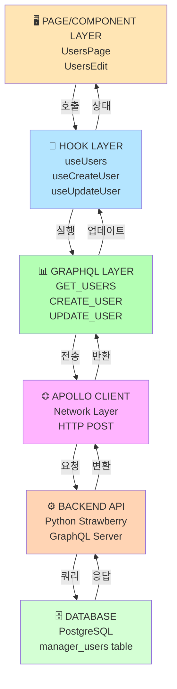

---

## 2. 사용자 목록 조회 (GET) - 완전 흐름

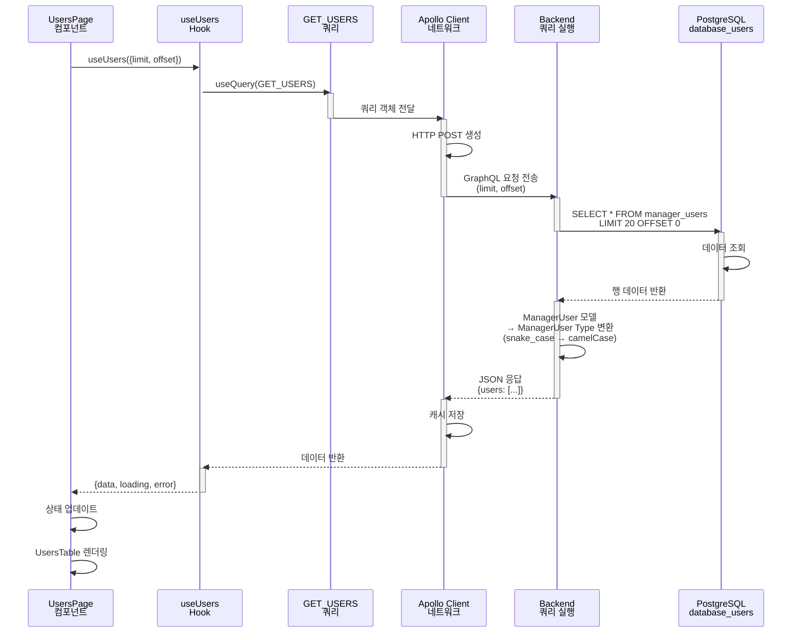

### 요청 데이터

```json
{
  "operationName": "GetUsers",
  "variables": {
    "limit": 20,
    "offset": 0,
    "userType": null,
    "status": null
  },
  "query": "query GetUsers(...) { users(...) { id userType fullName ... } }"
}
```

### 응답 데이터

```json
{
  "data": {
    "users": [
      {
        "id": "123e4567-e89b-12d3-a456-426614174000",
        "userType": "MASTER",
        "fullName": "Admin User",
        "email": "admin@example.com",
        "status": "ACTIVE",
        "createdAt": "2024-01-01T00:00:00Z",
        "updatedAt": "2024-01-15T10:30:00Z"
      }
    ]
  }
}
```

---

## 3. 사용자 생성 (CREATE) - 완전 흐름

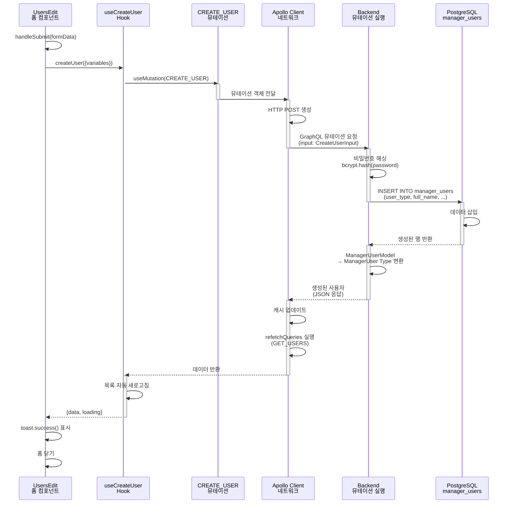

### 요청 데이터

```json
{
  "operationName": "CreateUser",
  "variables": {
    "input": {
      "userType": "MASTER",
      "fullName": "New User",
      "email": "user@example.com",
      "username": "newuser",
      "password": "SecurePassword123!",
      "phone": "010-1234-5678",
      "department": "Engineering"
    }
  },
  "query": "mutation CreateUser($input: CreateUserInput!) { createUser(input: $input) { ... } }"
}
```

### 응답 데이터

```json
{
  "data": {
    "createUser": {
      "id": "550e8400-e29b-41d4-a716-446655440000",
      "userType": "MASTER",
      "fullName": "New User",
      "email": "user@example.com",
      "username": "newuser",
      "status": "ACTIVE",
      "createdAt": "2024-01-20T15:30:00Z",
      "updatedAt": "2024-01-20T15:30:00Z"
    }
  }
}
```

---

## 4. 타입 변환 흐름

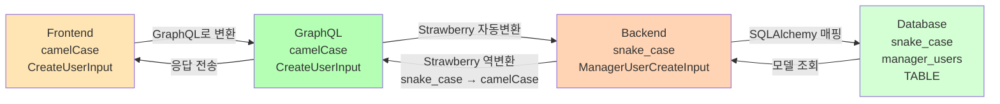

### 필드명 매핑 예시

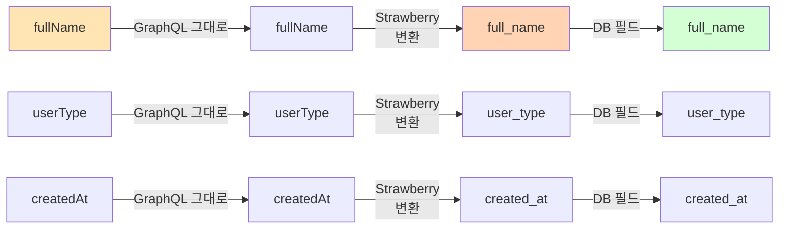

---

## 5. Hook과 Service의 관계

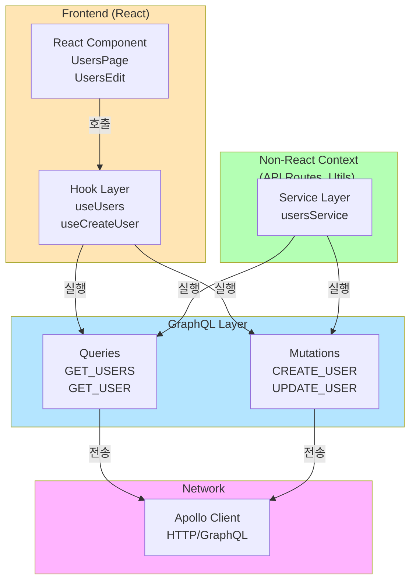

---

## 6. 상태 관리 흐름 (Apollo Cache)

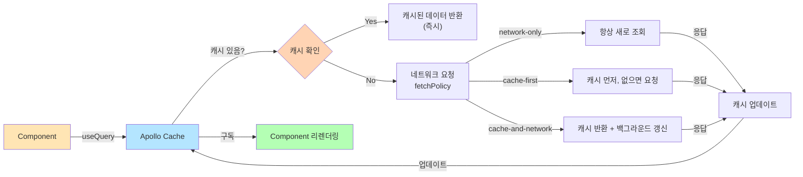

---

## 7. 에러 처리 흐름

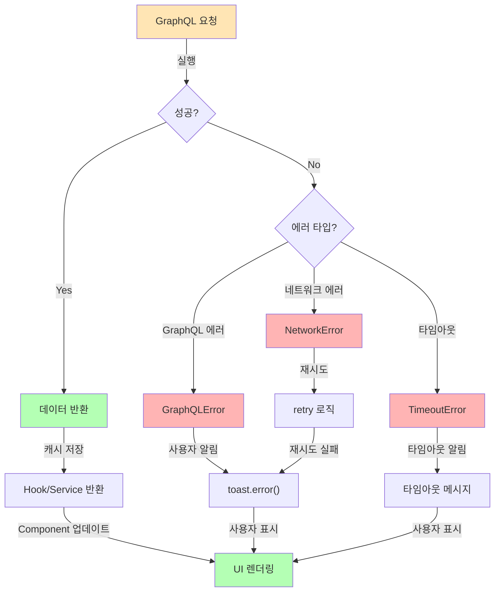

---

## 8. 6개 IDAM 모듈 구조 (동일 패턴)

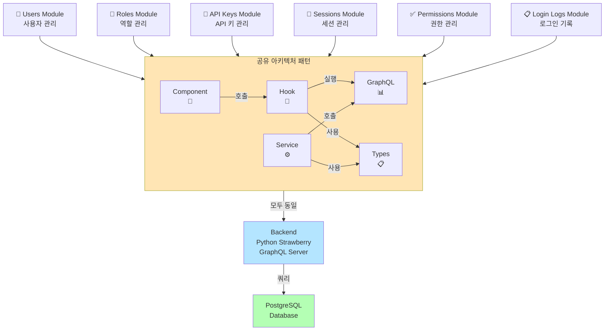

---

## 9. 단일 모듈 상세 구조 (Users 예시)

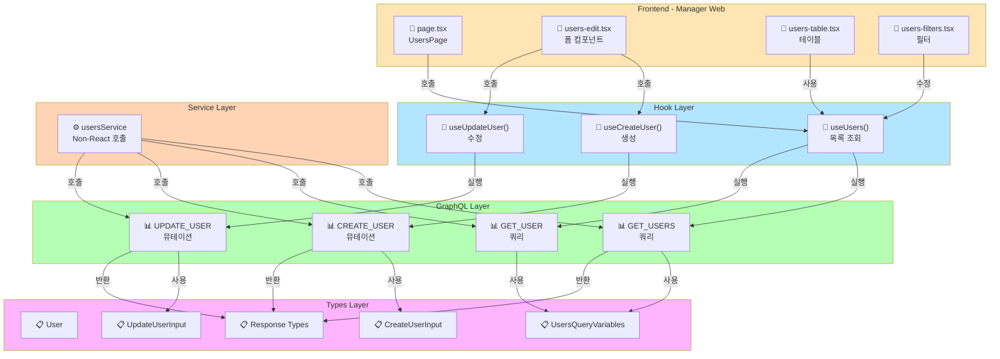

---

## 10. 데이터 흐름 타임라인 (시간 순서)

```mermaid
timeline
    title 사용자 목록 조회 실행 타임라인

    section 1단계: 초기화
        T0: UsersPage 컴포넌트 렌더링
        T1: useUsers({limit:20}) 호출 시작
        T2: loading = true 설정

    section 2단계: 요청 생성
        T3: GET_USERS 쿼리 구성
        T4: Apollo Client 준비
        T5: HTTP POST 생성

    section 3단계: 전송
        T6: 네트워크 요청 전송
        T7: Backend 도착
        T8: GraphQL 파서 처리

    section 4단계: 실행
        T9: users() 쿼리 실행
        T10: Database SELECT 실행
        T11: 데이터 조회 완료

    section 5단계: 응답
        T12: Type 변환 (snake_case → camelCase)
        T13: JSON 응답 생성
        T14: 클라이언트로 전송

    section 6단계: 처리
        T15: Apollo Cache 업데이트
        T16: Hook state 업데이트
        T17: loading = false 설정
        T18: Component 리렌더링

    section 7단계: 렌더링
        T19: UsersTable 렌더링
        T20: 사용자 목록 표시 완료
```

---

## 11. 동시 요청 처리 (병렬 쿼리)

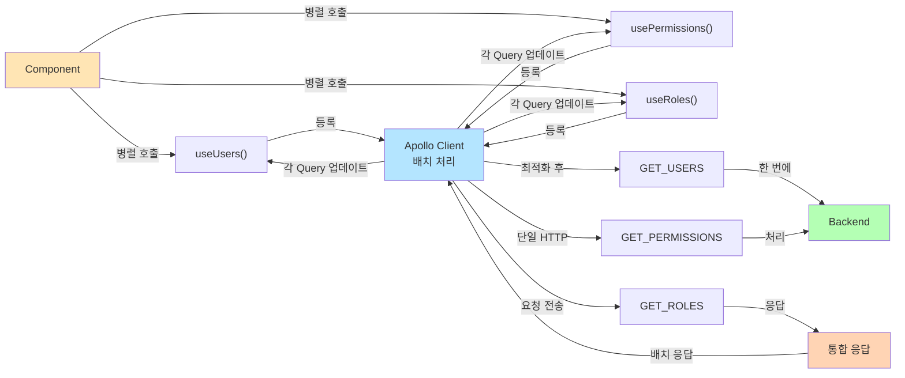

---

## 12. 캐시 무효화 및 재조회 (refetchQueries)

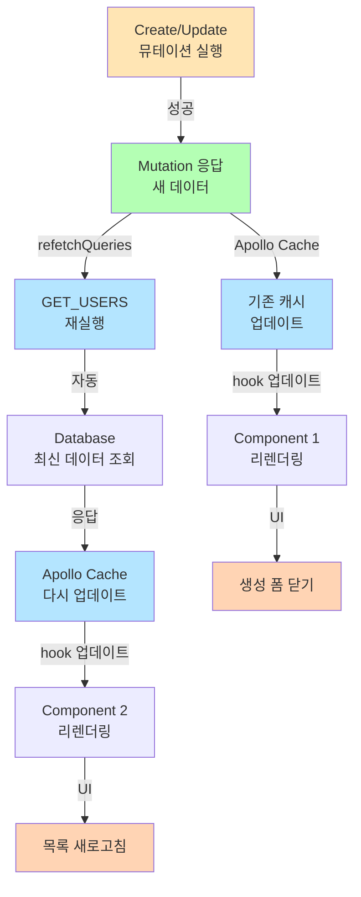

---

## 13. 에러 재시도 메커니즘

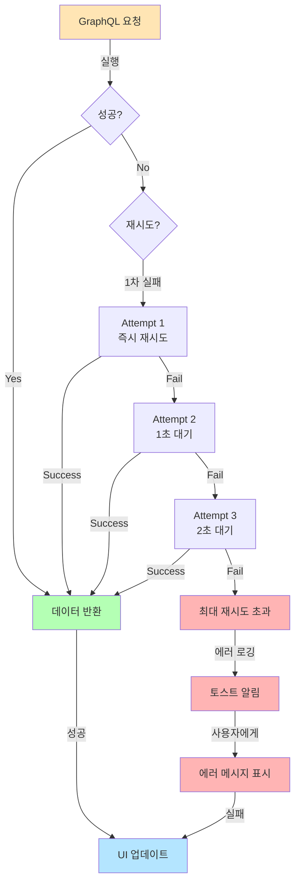

---

## 요약

### 주요 특징
- **계층 분리:** Page → Hook → GraphQL → Apollo → Backend → Database
- **타입 안전성:** TypeScript 전체 타입 지정
- **자동 변환:** Strawberry의 snake_case ↔ camelCase 자동 변환
- **캐시 관리:** Apollo Client 자동 캐시
- **재조회 자동화:** refetchQueries로 데이터 동기화
- **6개 모듈:** 동일한 패턴으로 구성

### 모듈 목록
1. **Users** - 사용자 관리
2. **Roles** - 역할 관리
3. **API Keys** - API 키 관리
4. **Sessions** - 세션 관리
5. **Permissions** - 권한 관리
6. **Login Logs** - 로그인 기록
